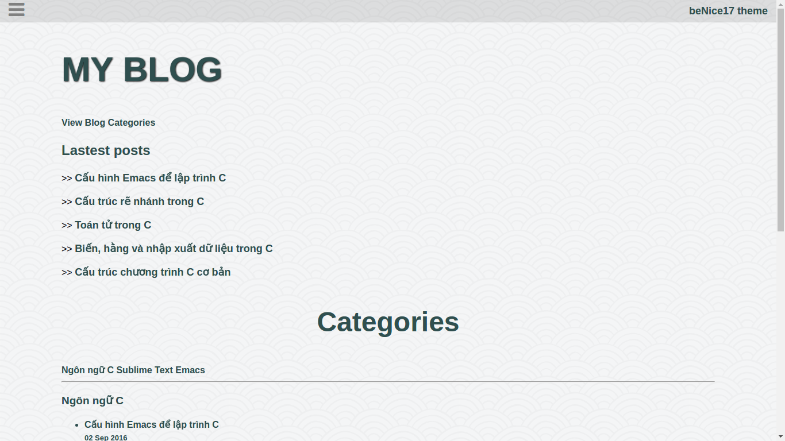
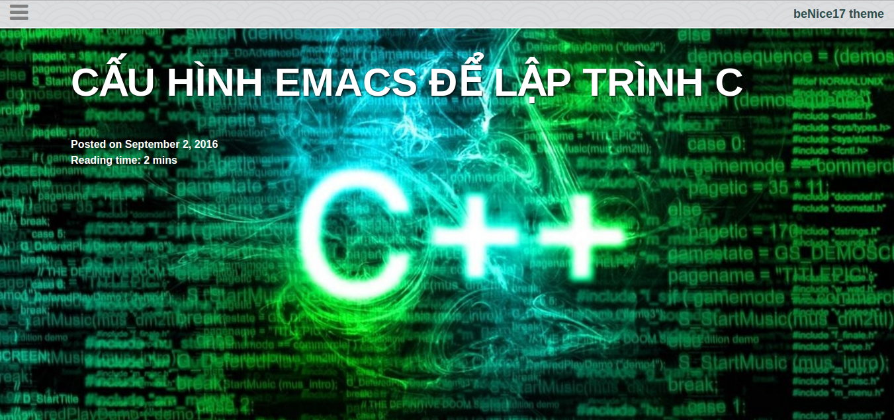
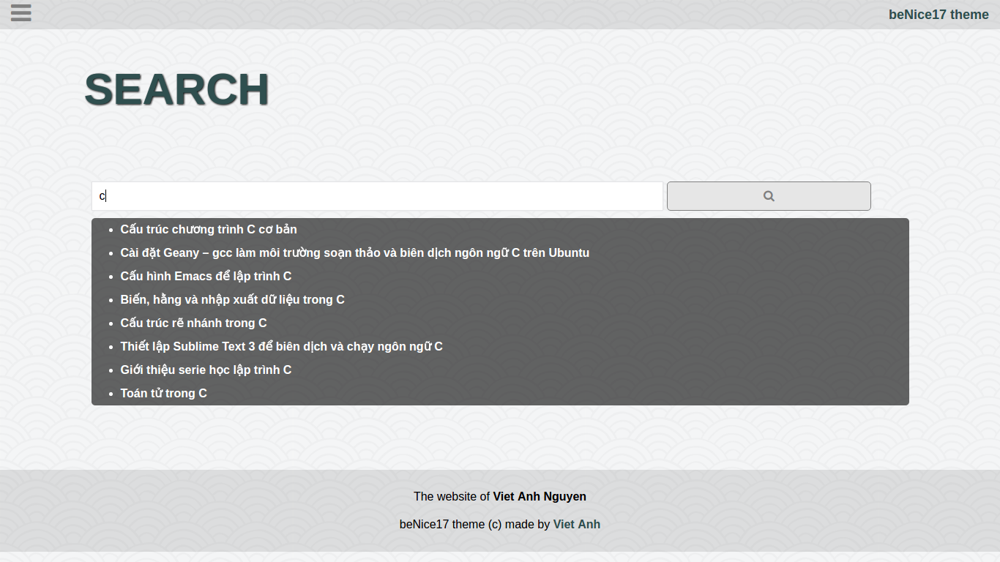

# BugOS
No ano passado, o tão complexo 2016, muitas pessoas trocaram de distros Linux e outras até as abandonaram. Mas a verdade é que muitos usuários iniciaram neste mundo gigante e outros trocaram para distros minimalistas, o que fizeram o volume de buscas crescer por seus nomes no buscador Google em vários meses no ano passado. É com base nisso que vou citar as distros Linux que eu tenho observado o crescimento nas buscas pela sonhada melhor distro linux.

## To use this distro
- é sem dúvida a distribuição mais popular no mundo inteiro.
- não é patrocinado pir ninguém.
- gratuito e é desenvolvido a partir da comunidade linux.
- com ênfase em ferramentas gráficas para usuários principiantes e ambiente esteticamente melhorado.
- seu princípio básico é basicamente o acordo social que cada sistema operacional e será desenvolvido 100% livre.

## Note:
- Read more about Jekyll at https://jekyllrb.com/ to fully configure your website.
- You can contact me for more support: benice17@vietanhdev.com

## Some screenshots:

- Homepage

- Menu

- Post list

- Big header image

- Code highlight

- Search page

